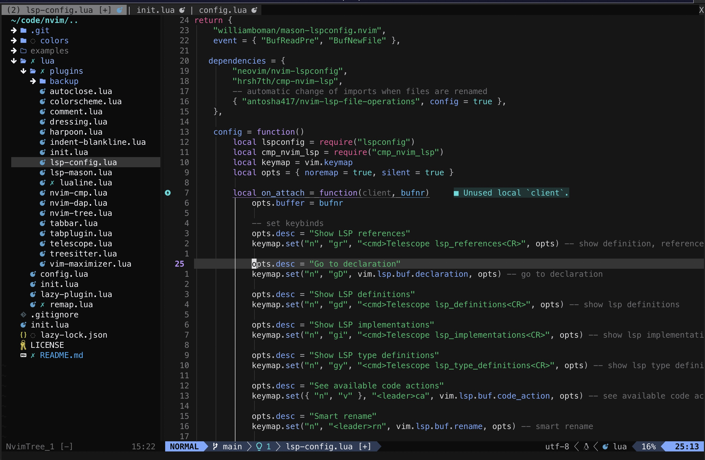
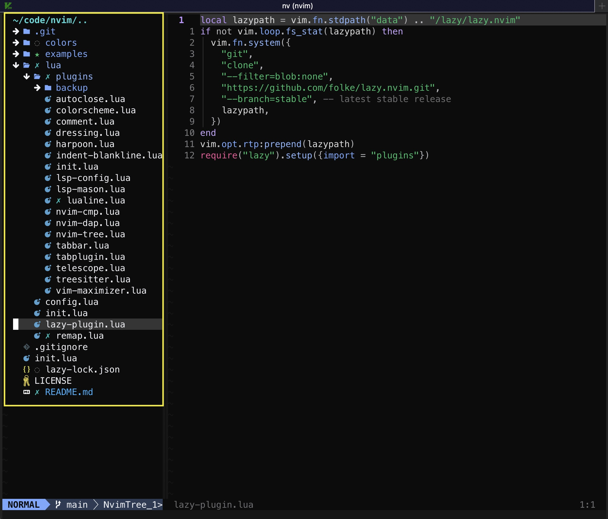
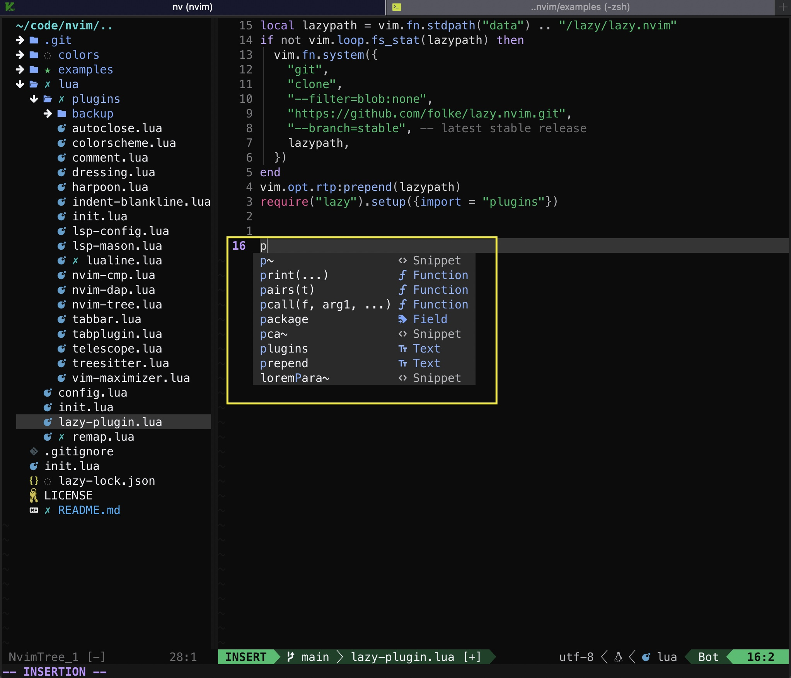
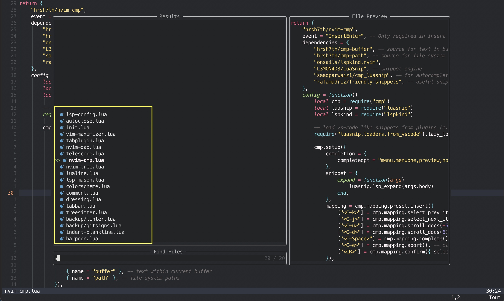

<h1 align="center"> NeoVim </h1>

## Objectives

- Store my configuration
- Make it available for re-use and learning purpose
- Keep track of my NeoVim journey

## Backlog / Todo

- git worktree & Telescope integration + futigive
- Nvim DAP & DAP UI for Debugging
- Marks plugin
- QuickFix list and shortcuts (e.g. compilation errors, unit test, linting)
  - global rename & change
  - Telescope finds sent to quickfix
- Explore advanced nvim cmd line utilities & tools

## Sample of key plugins

- Lazy (Plugins manager for NeoVim)
- Mason (Plugins manager for Linter, LSP, DAP, etc.)
- Telescope, TreeSitter, Harpoon2
- Comment, LuaSnip-cmp
- Flash, Trouble
- Lualine, Luatab
- nvim-dap, nvim-dap-ui
- nvim-lspconfig, nvim-cmp
- and much more...

## Table of contents

**[Shortcuts, tips & tricks](#shortcuts-tips--tricks) are at the end of this file**

- [My custom configuration](#my-custom-configuration)
  - [NvimTree specific (Tree)](#nvimtree-specific)
  - [CMP specific (Completion)](#cmp-specific-completion)
  - [Telescope Specific (Fuzzy Finder)](#telescope-specific-fuzzy-finder)
- [My cheat sheet (Standard Vim / Nvim)](#my-cheat-sheet-standard-vim--nvim)
  - [Mode switching](#mode-switching)
  - ['Command' mode](#command-mode)
  - ['Normal' mode - Navigation](#normal-mode---navigation)
  - ['Normal' mode - Editing](#normal-mode---editing)
  - ['Normal' mode - Split](#normal-mode---split)
  - ['Normal' model 'g' shortcuts](#normal-mode-g-shortcuts)
  - ['Insert' mode](#insert-mode)

## My custom configuration

- \<Leader> is mapped to space bar
- \<Option> is the macbook option key

| Required Plugin | Shortcut         | Mode    | Description                                                   |
| --------------- | ---------------- | ------- | ------------------------------------------------------------- |
| n/a             | `è`              | Normal  | CTRL-] to navigate in documentation (Swiss key)               |
| n/a             | `jk`or `kj`      | Insert  | Smart and fast escape \<ESC\>                                 |
| n/a             | `<Ctrl>d` or `u` | Normal  | Scoll Up or Down and center the cursor                        |
| n/a             | `>` or `<`       | N,V     | Indent Right / Left                                           |
| n/a             | `<Ctrl>j` or `k` | N,V,X   | Move selected line or block Up / down                         |
| n/a             | `<Ctrl>hjkl`     | Normal  | Split - Select split screen (hjkl)                            |
| n/a             | `<Option>hjkl`   | Normal  | Split - resize vertical & horizontal                          |
| n/a             | `<leader>sv`     | Normal  | Split - [s]plit [v]ertical                                    |
| n/a             | `<leader>sh`     | Normal  | Split - [s]plit [h]orizontal                                  |
| n/a             | `<leader>se`     | Normal  | Split - [s]plit [e]qual size                                  |
| n/a             | `<leader>sc`     | Normal  | Split - [s]plit [c]lose current                               |
| n/a             | `<leader>to`     | Normal  | Tab - [t]ab [o]pen                                            |
| n/a             | `<leader>tc`     | Normal  | Tab - [t]ab [c]lose                                           |
| n/a             | `<leader>tn`     | Normal  | Tab - [t]ab [n]ext                                            |
| n/a             | `<leader>tp`     | Normal  | Tab - [t]ab [p]revious                                        |
| n/a             | `<leader>tb`     | Normal  | Tab - [t]ab open current [b]uffer                             |
| n/a             | `<leader>bl`     | Normal  | Buffer - [b]uffer [n]ext                                      |
| n/a             | `<leader>bn`     | Normal  | Buffer - [b]uffer [p]revious                                  |
| n/a             | `<leader>bp`     | Normal  | Buffer - [b]uffer [l]ist (Telescope)                          |
| Nvim-Tree       | `<leader>ee`     | Normal  | NvimTree - [e]xplorer Toggle                                  |
| Nvim-Tree       | `<leader>ef`     | Normal  | NvimTree - [e]xplorer Toggle current [f]ile location          |
| Nvim-Tree       | `<leader>er`     | Normal  | NvimTree - [e]xplorer [r]efresh                               |
| Telescope       | `<leader>ff`     | Normal  | Telescope: [f]ind [f]iles (workspace)                         |
| Telescope       | `<leader>fs`     | Normal  | Telescope: [f]ile [s]earch fuzzy (buffer)                     |
| Telescope       | `<leader>fS`     | Normal  | Telescope: [f]ile [S]ymbols (buffer)                          |
| Telescope       | `<leader>/`      | Normal  | Telescope: [/] Fuzzily search (buffer)                        |
| Telescope       | `<leader>ft`     | Normal  | Telescope: [f]ind [t]odo (workspace)                          |
| Telescope       | `<leader>fm`     | Normal  | Telescope: [f]ind [m]arks                                     |
| Telescope       | `<leader>fM`     | Normal  | Telescope: [f]ind [M]an pages (cmd line man)                  |
| Telescope       | `<leader>fg`     | Normal  | Telescope: [f]ile [g]rep live (workspace)                     |
| Telescope       | `<leader>fG`     | Normal  | Telescope: [f]ind [G]rep word under the cursor (workspace)    |
| Telescope       | `<leader>fb`     | Normal  | Telescope: [f]ind [b]uffers                                   |
| Telescope       | `<leader>fh`     | Normal  | Telescope: [f]ind [h]elp                                      |
| Telescope       | `<leader>fo`     | Normal  | Telescope: [f]ind [o]ld files / History                       |
| Maximizer       | `<leader>m`      | Normal  | Maximizer - [m]ax/[m]in splitview                             |
| Nvim-LSP        | `gr`             | Normal  | LSP - [g]o [r]eferences (Telescope)                           |
| Trouble         | `gR`             | Normal  | LSP - [g]o [R]eferences (Trouble)                             |
| Nvim-LSP        | `gd`             | Normal  | LSP - [g]o [d]efinitions (Show definitions)                   |
| Nvim-LSP        | `gD`             | Normal  | LSP - [g]o to [D]eclaration                                   |
| Nvim-LSP        | `gi`             | Normal  | LSP - [g]o [i]mplementations (Show implementations)           |
| Nvim-LSP        | `gy`             | Normal  | LSP - [g]o T[y]pe definitions                                 |
| Nvim-LSP        | `<leader>ca`     | Normal  | LSP - [c]ode [a]ctions                                        |
| Nvim-LSP        | `<leader>sr`     | Normal  | LSP - [s]mart [r]ename                                        |
| Nvim-LSP        | `<leader>d`      | Normal  | LSP - [d]iagnostic (Show line diagnostics)                    |
| Nvim-LSP        | `<leader>D`      | Normal  | LSP - [D]iagnostics (Show buffer diagnostics)                 |
| Nvim-LSP        | `[d` or `]d`     | Normal  | LSP - Go to previous or next [d]iagnostic                     |
| Nvim-LSP        | `K`              | Normal  | LSP - [K] Show documentation for what is under cursor         |
| Nvim-LSP        | `<leader>lr`     | Normal  | LSP - [l]sp [r]estart                                         |
| Nvim-LSP        | `[[`or `]]`      | Normal  | LSP - <i>special</i> e.g jump next / previous class           |
| Nvim-LSP        | `[m`or `]m`      | Normal  | LSP - <i>special</i> e.g jump next / previous method in class |
| Flash           | `s`              | N, X, O | Flash - [s]earch (flash)                                      |
| Flash           | `S`              | N, X, O | Flash - [s]earch (treesitter)                                 |
| Flash           | `R`              | X, O    | Flash - [R] Treesitter (e.g. with copy or yank)               |
| Comments        | `gcR`            | N, V    | Comment - [g]o [c]omment new (Flash / Treesitter)             |
| Comments        | `gco` or `gcO`   | N, V    | Comment - [g]o [c]omment new below or above line              |
| Comments        | `gcA`            | N, V    | Comment - [g]o [c]omment new (end of the line)                |
| Comments        | `gcc`            | N, V    | Comment - [g]o [c]comment / Un-comment line                   |
| Comments        | `gcip`           | N, V    | Comment - [g]o [c]comment / Un-comment paragraph              |
| Comments        | `gbc`            | N, V    | Comment - [g]o [b]lock comment / Un-comment                   |
| Harpoon2        | `<leader>hl`     | Normal  | Harpoon - [h]arpoon [l]ist                                    |
| Harpoon2        | `<leader>ha`     | Normal  | Harpoon - [h]arpoon [a]ppend                                  |
| Harpoon2        | `<leader>hc`     | Normal  | Harpoon - [h]arpoon [c]lear list                              |
| Harpoon2        | `<leader>hr`     | Normal  | Harpoon - [h]arpoon [r]remove current item                    |
| Harpoon2        | `<leader>p`      | Normal  | Harpoon - [p]revious item                                     |
| Harpoon2        | `<leader>n`      | Normal  | Harpoon - [n]ext item                                         |
| Conform         | `<leader>lf`     | N, V    | Language - [l]anguage [f]ormatter (Conform)                   |
| Linting         | `<leader>ll`     | Normal  | Language - [l]anguage [l]inter (nvim-lint)                    |
| n/a             | `<leader>li`     | Normal  | Language - [l]sp [i]nspect                                    |
| Trouble         | `<leader>xx`     | Normal  | Trouble - [x] Toggle                                          |
| Trouble         | `<leader>xw`     | Normal  | Trouble - [x] Toggle [w]orkspace diagnostics                  |
| Trouble         | `<leader>xd`     | Normal  | Trouble - [x] Toggle [d]ocument diagnostics                   |
| Trouble         | `<leader>xq`     | Normal  | Trouble - [x] Toggle [q]uickfix list                          |
| Trouble         | `<leader>xl`     | Normal  | Trouble - [x] Toggle [l]oc list                               |

### NvimTree specific

Navigating in NvimTree (mainly default settings)  

- ctrl-t = Open file in new tab  
- ctrl-v = Open in vertical split  
- ctrl-x = Open in horizontal split  
- Enter or o = Open in a new buffer  
- Tab = Open in a new buffer but stay in the Tree  
- a = Create a new file / folder  
- d = Delete a file or folder  

### CMP Specific (completion)

Completion navigation (mainly default settings)

- Ctrl-k / Ctrl-j = select next / previous item 
- Tab / Shift + Tab = select next / previous item 
- Enter = confirm 
- Ctrl-u = Scroll in the documentation (up) 
- Ctrl-d = Scroll in the documentation (down) 
- Ctrl-Space = show completion window 
- Ctrl-e = close completion window 

### Telescope Specific (Fuzzy Finder)

Navigation and interaction with Telescope (mainly default settings)

- Ctrl-h = Open in new Horizontal split 
- Ctrl-v = Open in new Vertical split 
- Ctrl-t = Open in a new Tab 
- Ctrl-k / Ctrl-l = Scroll up/down 
- Ctrl-u / Ctrl-d = Scroll up/down for preview 
- \<Tab> & \<S-Tab> = Scroll up/down and Select 
- Ctrl-q = Move selected items in quickfix list 
- Enter = confirm 

## My cheat sheet (Standard Vim / Nvim)

This is not yet another manual or cheat sheet. 
The goal is to maintain here the shortcuts that I'm frequently using.

### Mode switching

| Shortcut  | Description                          |
| --------- | ------------------------------------ |
| `i`       | Enter Insert mode                    |
| `:`       | Enter Command mode                   |
| `R`       | Enter Replace mode                   |
| `v`       | Enter Visual mode (hilighting)       |
| `V`       | Enter line Visual mode (hilighting)  |
| `<ctrl>v` | Enter Visual block mode (hilighting) |
| `esc`     | Return to Normal mode                |

### 'Command' mode

Enter in <b>Command</b> mode by typing ':'

| Shortcut                    | Description                                        |
| --------------------------- | -------------------------------------------------- |
| `Ctrl-y`                    | Accept current selection (completion)              |
| `Ctrl-e`                    | Reject current selection (completion)              |
| `<Tab> <S-Tab>`             | Completion Up or Down                              |
| `:q`                        | 'Quit' - will fail in case of unsaved changes      |
| `:q!`                       | 'Quit' - Force Quit (Discard unsaved changes)      |
| `:w`                        | 'Write' - Save current file                        |
| `:wa`                       | 'Write all' - Save all open files                  |
| `:wq` / `:x`                | 'Write & Quit' - Save current file & Quit          |
| `:e filename`               | 'Edit' - Open filename in current buffer           |
| `:[RANGE]s/FOO/BAR/[FLAGS]` | 'Substitue' FOO with BAR for the current line      |
| `:sp [file]` / `:vs [file]` | Split horizontal / vertical, optionnaly add a file |

| SUBSTITUTE RANGE | Description                                                 |
| ---------------- | ----------------------------------------------------------- |
| `%`              | Entire File                                                 |
| `’<,’>'`         | Current selection, default range in visual mode             |
| `25`             | Line 25                                                     |
| `25,50`          | Line 25 - 50                                                |
| `$`              | Last line; can be combined with other lines as in ‘50,$’    |
| `.`              | Current line; can be combined with other lines as in ‘.,50’ |

| SUBSTITUTE FLAGS | Description                 |
| ---------------- | --------------------------- |
| `g`              | Global, for the entire file |
| `i`              | Ignore case                 |
| `c`              | Confirm each subtitution    |

### 'Normal' mode - Navigation

| Shortcut                  | Description                                                              |
| ------------------------- | ------------------------------------------------------------------------ |
| `h` / `j` / `k` / `l`     | Move left / down / up / right                                            |
| `H` / `M` / `L`           | Top / Middle / Bottom line on the screen                                 |
| `zz` / `zt` / `zb`        | Center / Top / Bottom this line                                          |
| `gg` / `G`                | First line / last line of the file                                       |
| `{` / `}`                 | Jump to the next or previous empty line (i.e paragraph jump)             |
| `[[` / `]]`               | Jump to the next or previous section                                     |
| `e` / `b` / `w`           | End of the word / Beginning of the word / Beginning of the next word     |
| `:[+\|-][LINE]`           | Go To Line [LINE]. + or - to be used for relative lines                  |
| `[NUMBER]j` / `[NUMBER]k` | Go Up / Down [NUMBER] lines (i.e. useful with relative line numbers)     |
| `0` / [`^` or `_`]        | Beginning of the line / First white space of the line                    |
| `$`                       | End of the line                                                          |
| `%`                       | Move to matching parenthesis, bracket or curly brace                     |
| `f{c}` / `F{c}`           | Go forward / backward to character {c}                                   |
| `t{c}` / `T{c}`           | Go towards next / previous occurence of character {c} & stop before      |
| `;` / `,`                 | Repeat previous f, F, t, or T movement forward / backward                |
| `[COUNT]{` / `[COUNT]}`   | [COUNT] paragraphs backward / forward                                    |
| `ctrl-u` / `ctrl-d`       | Half-Page Up / Down                                                      |
| `ctrl-b` / `ctrl-f`       | Page Up / Down                                                           |
| `/text` / `n` / `N`       | Search - Search text (i.e. can contain regexp) / n - next / N - Previous |
| `*` / `#`                 | Search - Next / previous for the whole word under the cursor             |
| `m{c}`                    | Mark - Save current location in register {c}                             |
| `'{c}`                    | Mark - Go to the mark saved in register {c}                              |
| `[COUNT]gt` / `gT`        | Go to tab page [COUNT]                                                   |

<i> The left, right, up and down arrow keys can also be used to navigate. </i>

### 'Normal' mode - Editing

Yank / Cut / Delete commands operate on the specified range, 
    - If in <b>Visual</b> mode, that range is the highlighted text  
    - If in <b>Normal</b> mode, that range is specified by a series of modifiers to the commands

| Shortcut             | Description                                                                     |
| -------------------- | ------------------------------------------------------------------------------- |
| `i` / `I`            | 'Insert' Get into Insert mode / At the first white space of the line            |
| `a` / `A`            | 'Append' Get into Insert mode after the cursor / At the end of the line         |
| `r` / `R`            | 'Replace' Get into Replace mode for 1 character / for the entire line           |
| ~`s` / `S`~          | ~'Substitue' Character / Line~ -> 's' and 'S' used by Flash plugin              |
| `x` / `X`            | 'Delete' forward / backward from current character                              |
| `u` / `Ctrl-R`       | Undo / Redo                                                                     |
| `o` / `O`            | create a line below / create a line above, and switch to Insert mode            |
| `C`                  | Change current line - Delete rest of the line and get into Insert mode          |
| `D`                  | Change current line - Delete rest of the line and stay in Normal mode           |
| `Y`                  | Yank current line - Copy rest of the line and stay in Normal mode               |
| `cc`                 | Change / Cut - Delete current line and get into Insert mode                     |
| `dd`                 | Delete - Delete entire line                                                     |
| `yy`                 | Yank - Copy the entire line get and stay in Normal mode                         |
| `P` / `p`            | Paste before the cursor / after the cursor                                      |
| `X` / `x`            | Delete character before the cursor / after the cursor                           |
| `cw`                 | Change / Cut Word - Delete end of the word and get into Insert mode             |
| `c4w`                | Change / Cut 4 Words - Delete end of the words, next 4 and get into Insert mode |
| `c4l`                | Change / Cut 4 Letters - Delete next 4 letters and get into Insert mode         |
| `ciw`                | Change / Cut In Word - Delete current word and get into Insert mode             |
| `ci(`                | Change / Cut Inside Parenthesis                                                 |
| `dw`                 | Delete Word - Delete end of the word and stay in Normal mode                    |
| `diw`                | Delete In Word - Delete current word and stay in Normal mode                    |
| `dip`                | Delete Inside Paragraph - Delete current Paragraph                              |
| `yw`                 | Yank Word - Copy end of the word and stay in Normal mode                        |
| `yiw`                | Yank In Word - Copy current word and stay in Normal mode                        |
| `xp`                 | Transpose current character                                                     |
| `.`                  | Repeat the last change that was made                                            |
| `[COUNT]<Ctrl-a\|x>` | Increment or Decrement the number under the cursor,optionnaly use COUNT         |

<i> (i)nner, (a)round, (w)ord, (s)entence,(l)etter, (p)aragraph </i>

### 'Normal' mode - Split

| Shortcut             | Description                                           |
| -------------------- | ----------------------------------------------------- |
| `<ctrl-w>h\|j\|k\|l` | Split - Navigate to the split screen (hjkl)           |
| `<ctrl-w>H\|J\|K\|L` | Split - Move to the split screen (HJKL)               |
| `<ctrl-w>v`          | Split - New Vertical split screen                     |
| `<ctrl-w>s`          | Split - New Horizontal split screen                   |
| `<ctrl-w>=`          | Split - Set same size for all the split screens       |
| `<ctrl-w>+\|-`       | Split - Horizontal resize                             |
| `<ctrl-w>>\|<`       | Split - Vertical resize                               |
| `<ctrl-w>f`          | Split - Open the file under the cursor in a new split |

### 'Normal' mode 'g' shortcuts

| Shortcut          | Description                                                                |
| ----------------- | -------------------------------------------------------------------------- |
| `gj` / `gk`       | Move up/down in case of text spanning over multiple lines                  |
| `g$` / `g0`/ `g^` | Same as existing navigation shortcuts but operating for spanning text      |
| `gqq`             | Transform spanning text to seperate lines                                  |
| `gJ` / `J`        | Join the current line and the line beneath it with no space / keep a space |
| `gU` / `gu`       | Uppercase / Lowercase (e.g. 'gUiw' -> full word under cursor in UPPERCASE) |
| `g~`              | Switching capitalization                                                   |
| `gUU` / `guu`     | Uppercase / Lowercase the entire line                                      |
| `gf`              | Open the file under the cursor in nvim in current window                   |
| `gv`              | Jump back to previouly seclected text and go back into 'Visual' mode       |
| `g&`              | Execute the previous substituion accross the entire file                   |

### "Insert" Mode

| Shortcut             | Description                      |
| -------------------- | -------------------------------- |
| `<Ctrl-o> {Command}` | Execute a command in Insert mode |

## Shortcuts, tips & tricks

### Core

- `:Lazy`: Plugin managemet
- `:Mason`: LSP, Linter, Formater, DAP installer
- `:checkhealth`: Check the health of all plugins
- `:InspectTree`: Treesitter inspection tree
- `:TOhtml`: Convert buffer into html incl. color coding

### Advanced

> **How to copy from a buffer to cmd line ?**
>
> - Yank line in current buffer and then \<ctrl>R-0 in cmd line
> - Yank line to a specific register (e.g. <"ayy> will yank in register "a"), then \<ctrl>R-"a" 

> **How to copy from a buffer to the clipboard ?**
>
> - Yank to the register "+" or "\*" (e.g. <"+yy>)
> - Using wezterm terminal, enter in copy mode with \<Ctrl> + \<Shift> + x

> **While searching i.e.'/', how to jump between results live ?**
>
> - Use \<ctrl-t> & \<ctrl-g> to move between next & previous match

> **How to move in the <u>jumplist</u> ?**  
> So called jump commands that are stored in the jump list:  
> "'", "`", "G", "/", "?", "n", "N", "%", "(", ")", "[[", "]]", "{", "}", ":s", ":tag", "L", "M", "H"  
> _It can be very useful when browsing the help pages_
>
> - Use \<ctrl-o> & \<ctrl-i> to go to older & newer positions in jump list

> **How to move in the <u>changelist</u> ?**  
> When making a change the cursor position is remembered.
>
> - Use \<g;> & \<g,> to go to older & newer positions in the change list
